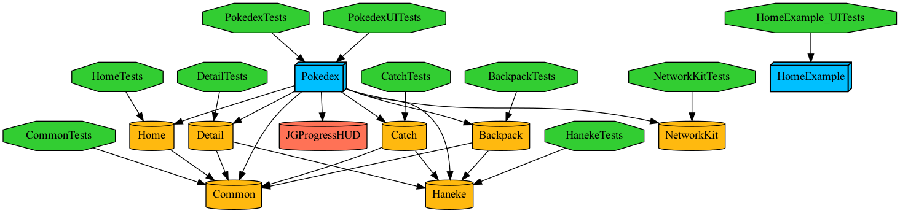

# FindDependencies
A CLI to find and list out the dependents and dependencies for a module in a Tuist project by parsing the graph.

I developed it as a helper tool for a script that is a wrapper for generating code with Sourcery, but it could be used in a CI workflow for checking which modules depend on it. 

USAGE: find-dependencies [--show-dependencies] [--show-dependents] [--debug] [--path &#60;path&#62;] &#60;module-name&#62;

ARGUMENTS:
  &#60;module-name&#62;           The module you are interested in.

OPTIONS:
  --show-dependencies     Show the dependencies of named module.<br>
  --show-dependents       Show the dependents of named module.<br>
  -d, --debug             Show the dependents of named module.<br>
  -p, --path <path>       The path to the Project.swift file.<br>
  -h, --help              Show help information.<br><br>
  
I had some issue with using Tuist.graph() so I opted for triggering the graph command to write a JSON file. But this seems to be a problem when the path parameter is used, which means the command must be invoked in the same directory as the Project.swift file. Thus, this command expects a graph.json to exist at the path passed to it. 

An improvement would be to use the Tuist.graph() directly. 

## Testing
  
The testing is based on the project graph found under Tests/FindDependenciesTests

The JSON file has a visual PNG representation
  


Test 1: Show Dependencies
  
Open the project and edit the scheme. Add an argument passed on launch: 
```
--show-dependencies -p ../../../../Tests/FindDependenciesTests Backpack
```

You will see this in the console output in Xcode

```
Common
Haneke
```

Test 2: Show Dependents
  
Edit the scheme again, disable the previous argument, and add another argument:
```
  --show-dependents -p ../../../../Tests/FindDependenciesTests Common
```
  
This produces the following output: 
```
Pokedex
Home
Backpack
Detail
Catch
CommonTests
```
  

## Known Issues
This code works for framework targets but not work as intended for the main app target in that it will not output a trimmed target name and it does not filter out external dependencies. 
For example: 

```
*> FindDependencies --show-dependencies -p ./ Pokedex
Haneke
Home
Backpack
Detail
Catch
Common
NetworkKit
: "JGProgressHUD", path: "/Users/ronanoc/Projects/Tuist-Pokedex/Tuist/Dependencies/SwiftPackageManager/.build/checkouts/JGProgressHUD
```


